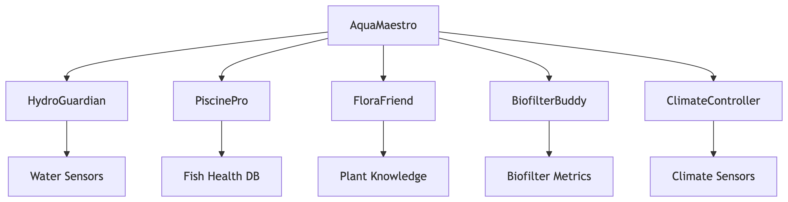

# Mindponics: Aquaponics Multi-Agent System

Mindponics is an advanced aquaponics monitoring and management system powered by Google's Agent Development Kit (ADK). This project uses a multi-agent architecture where specialized AI agents collaborate to optimize and maintain a balanced aquaponics ecosystem.

## Key Features

- **Multi-Agent Architecture:** Six specialized agents working in harmony
- **Real-time Monitoring:** Continuous tracking of water, fish, plant, and environmental parameters
- **Intelligent Recommendations:** AI-driven insights for system optimization
- **Predictive Maintenance:** Early detection of potential issues
- **Modular Design:** Easy to extend with new agents and functionality

## System Architecture
This diagram illustrates the core components and their relationships within the AquaMaestro system.




## Specialized Agents

| Agent Name     | Role             | Key Responsibilities                                                  |
|----------------|------------------|-----------------------------------------------------------------------|
| AquaMaestro    | Orchestrator     | Coordinates all agents, handles user queries                          |
| HydroGuardian  | Water Quality    | Monitors pH, ammonia, nitrites, nitrates, DO                          |
| PiscinePro     | Fish Health      | Manages fish health, feeding, disease detection                       |
| FloraFriend    | Plant Growth     | Optimizes plant health, nutrient management                           |
| BiofilterBuddy | Bacteria Management | Maintains nitrification cycle, biofilter health                     |
| ClimateController | Environment Control | Manages temperature, humidity, light cycles                     |

## Getting Started

### Prerequisites

* Python 3.13+
* Google ADK
* Google Cloud account (for deployment)
* Virtual environment (recommended)

### Installation

1.  Prerequisites:

    ```bash
    pip install poetry
    ```

2. Installation:

    ```bash
    git clone [https://github.com/your-username/Mindponics.git](https://github.com/your-username/Mindponics.git)
    cd Mindponics
    # Install the package and dependencies.
    poetry install
    ```

3.  Configuration`:

    *   Set up Google Cloud credentials.

        *   You may set the following environment variables in your shell, or in
            a `.env` file instead.

        ```bash
        export GOOGLE_GENAI_USE_VERTEXAI=true
        export GOOGLE_CLOUD_PROJECT=<your-project-id>
        export GOOGLE_CLOUD_LOCATION=<your-project-location>
        export GOOGLE_CLOUD_STORAGE_BUCKET=<your-storage-bucket>  # Only required for deployment on Agent Engine
        ```

    *   Authenticate your GCloud account.

        ```bash
        gcloud auth application-default login
        gcloud auth application-default set-quota-project $GOOGLE_CLOUD_PROJECT
        ```


## Running the Agent

**Using `adk`**

ADK provides convenient ways to bring up agents locally and interact with them.
You may talk to the agent using the CLI:

```bash
adk run mindponics
```

Or on a web interface:

```bash
 adk web
```

The command `adk web` will start a web server on your machine and print the URL.
You may open the URL, select "mindponics" in the top-left drop-down menu, and
a chatbot interface will appear on the right. The conversation is initially
blank. Here are some example requests you may ask the Financial Advisor to verify:

```
hi
```

Sampled responses of these requrests are shown below in the [Example
Interaction](#example-interaction) section.

```
Hello! I'm AquaMaestro, the central orchestrator of the mindponics aquaponics AI system. I'm here to help you with any questions or concerns you may have about your aquaponics system. How can I help you today?

```

## Usage Examples

### Checking Water Quality
```bash
User: What's the current water quality status?
AquaMaestro: Consulting HydroGuardian...
HydroGuardian: Current pH: 7.2, Ammonia: 0.3 mg/L, Nitrites: 0.1 mg/L.
Water quality is optimal. No action needed.
```
### Diagnosing Plant Issues
```bash
User: My lettuce leaves are turning yellow. What should I do?
AquaMaestro: Delegating to FloraFriend...
FloraFriend: Yellow leaves typically indicate nitrogen deficiency. 
Recommend increasing nitrate levels to 40-60 ppm.
```
### System Optimization
```bash
User: How can I improve overall system efficiency?
AquaMaestro: Coordinating with all specialists...
- HydroGuardian: Recommends reducing feed to lower ammonia
- PiscinePro: Suggests adjusting feeding schedule
- FloraFriend: Proposes increasing plant density
- BiofilterBuddy: Advises adding beneficial bacteria
- ClimateController: Suggests optimizing light cycles
```
## Directory Structure
```bash
Mindponics/
├── agent/                   # Main agent module
│   ├── __init__.py
│   └── mindponics_agent.py  # Root agent definition
├── config/
│   └── settings.yaml        # Configuration file
├── mindponics/              # Specialized agents
│   ├── water/               # HydroGuardian
│   ├── fish/                # PiscinePro
│   ├── plant/               # FloraFriend
│   ├── bacteria/            # BiofilterBuddy
│   ├── environment/         # ClimateController
│   └── orchestrator/        # AquaMaestro
├── utils/                   # Utility functions
│   └── sensor_utils.py      # Sensor data handling
├── .env    
├── mindponics.png 
├── poetry.lock
├── pyproject.toml      # Dependencies
└── README.md                # This file
```
## Contributing

We welcome contributions! Please follow these steps:

1.  Fork the repository
2.  Create a new branch (`git checkout -b feature/your-feature`)
3.  Commit your changes (`git commit -am 'Add some feature'`)
4.  Push to the branch (`git push origin feature/your-feature`)
5.  Create a new Pull Request

## License

This project is licensed under the Apache License 2.0 - see the LICENSE file for details.

## Acknowledgments

* Google ADK team
* Aquaponics research community