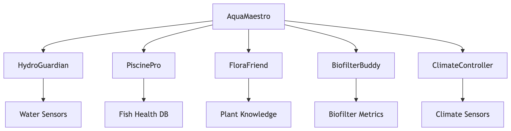

# Mindponics: Aquaponics Multi-Agent System

Mindponics is an advanced aquaponics monitoring and management system powered by Google's Agent Development Kit (ADK). This project uses a multi-agent architecture where specialized AI agents collaborate to optimize and maintain a balanced aquaponics ecosystem.

## Key Features

- **Multi-Agent Architecture:** Six specialized agents working in harmony
- **Real-time Monitoring:** Continuous tracking of water, fish, plant, and environmental parameters
- **Intelligent Recommendations:** AI-driven insights for system optimization
- **Predictive Maintenance:** Early detection of potential issues
- **Modular Design:** Easy to extend with new agents and functionality

## System Architecture
This diagram illustrates the core components and their relationships within the AquaMaestro system.




graph TD
    A[AquaMaestro] --> B[HydroGuardian]
    A --> C[PiscinePro]
    A --> D[FloraFriend]
    A --> E[BiofilterBuddy]
    A --> F[ClimateController]
    B --> G[Water Sensors]
    C --> H[Fish Health DB]
    D --> I[Plant Knowledge]
    E --> J[Biofilter Metrics]
    F --> K[Climate Sensors]

## Specialized Agents

| Agent Name     | Role             | Key Responsibilities                                                  |
|----------------|------------------|-----------------------------------------------------------------------|
| AquaMaestro    | Orchestrator     | Coordinates all agents, handles user queries                          |
| HydroGuardian  | Water Quality    | Monitors pH, ammonia, nitrites, nitrates, DO                          |
| PiscinePro     | Fish Health      | Manages fish health, feeding, disease detection                       |
| FloraFriend    | Plant Growth     | Optimizes plant health, nutrient management                           |
| BiofilterBuddy | Bacteria Management | Maintains nitrification cycle, biofilter health                     |
| ClimateController | Environment Control | Manages temperature, humidity, light cycles                     |

## Getting Started

### Prerequisites

* Python 3.10+
* Google ADK
* Google Cloud account (for deployment)
* Virtual environment (recommended)

### Installation

1.  Clone the repository:

    ```bash
    git clone [https://github.com/your-username/Mindponics.git](https://github.com/your-username/Mindponics.git)
    cd Mindponics
    ```

2. Create and activate a virtual environment:

    ```bash
    python -m venv .venv
    source .venv/bin/activate   # Linux/Mac
    .venv\Scripts\activate     # Windows
    ```

3.  Install dependencies:

    ```bash
    pip install -r requirements.txt
    ```

4.  Set up Google ADK:

    ```bash
    pip install google-adk
    ```

## Configuration

1.  Create a `config/settings.yaml` file with your agent configurations:

    ```yaml
    agents:
      - name: root_agent
        type: root
        config:
          orchestrator_id: orchestrator
      - name: water_agent
        type: water_quality

    # Add configurations for other agents
    ```

2.  Set up environment variables for Google Cloud integration:

    ```bash
    export GOOGLE_APPLICATION_CREDENTIALS="path/to/your/service-account-file.json"
    ```

## Running the System

```bash
adk run Mindponics
```

## Usage Examples

### Checking Water Quality
```bash
    User: What's the current water quality status?
    AquaMaestro: Consulting HydroGuardian...
    HydroGuardian: Current pH: 7.2, Ammonia: 0.3 mg/L, Nitrites: 0.1 mg/L. 
                   Water quality is optimal. No action needed.
```
### Diagnosing Plant Issues
```bash
    User: My lettuce leaves are turning yellow. What should I do?
    AquaMaestro: Delegating to FloraFriend...
    FloraFriend: Yellow leaves typically indicate nitrogen deficiency. 
                 Recommend increasing nitrate levels to 40-60 ppm.
```
### System Optimization
```bash
User: How can I improve overall system efficiency?
AquaMaestro: Coordinating with all specialists...
- HydroGuardian: Recommends reducing feed to lower ammonia
- PiscinePro: Suggests adjusting feeding schedule
- FloraFriend: Proposes increasing plant density
- BiofilterBuddy: Advises adding beneficial bacteria
- ClimateController: Suggests optimizing light cycles
```
## Directory Structure
```bash
Mindponics/
├── agent/                   # Main agent module
│   ├── __init__.py
│   └── mindponics_agent.py  # Root agent definition
├── config/
│   └── settings.yaml        # Configuration file
├── sub_agents/              # Specialized agents
│   ├── water/               # HydroGuardian
│   ├── fish/                # PiscinePro
│   ├── plant/               # FloraFriend
│   ├── bacteria/            # BiofilterBuddy
│   ├── environment/         # ClimateController
│   └── orchestrator/        # AquaMaestro
├── utils/                   # Utility functions
│   └── sensor_utils.py      # Sensor data handling
├── requirements.txt         # Dependencies
└── README.md                # This file
```
